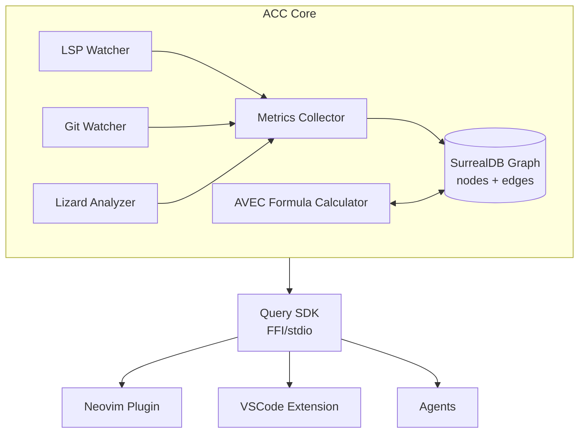

# ACC - Adaptive Codec Context


> A living physics engine for codebases. ACC models structure, stability, and complexity as continuous dimensional metrics. Giving you and your tools queryable intelligence over how your code actually behaves.


## What is ACC?

ACC (Adaptive Codec Context) transforms codebases into a **dimensional semantic graph** where every code entity (class, function, module) is measured across four dimensions:

- **Stability** - How often does this break? (git churn + contributors + test coverage)
- **Logic** - How much reasoning is packed here? (cyclomatic complexity + LOC)
- **Friction** - How many things depend on this? (incoming edges + centrality)
- **Autonomy** - How self-directed is this code? (outgoing dependencies inverse)

These dimensions form **AVEC** (Attractor Vector Encoding Configuration) - coordinates in a 4D space that describe a codebase health at an abstract layer that can be understood from multiple lenses.


## Why ACC?

Understanding your codebase matters  not because AI needs it, but because you do. How code changes over time, where the real complexity lives, what breaks when you touch something, this is knowledge that gets lost as teams and codebases grow.
ACC makes that knowledge explicit. It models your code as a living graph with dimensional metrics (AVEC) that capture stability, logic density, friction, and autonomy. Not as a snapshot, but continuously, as your codebase evolves.
The agent tooling is a consequence of that, not the point. A well-indexed codebase is useful to every tool that touches it, including the one between your ears.

## Philosophy

> "Real people want AI to power them, not replace them."

ACC provides **exoskeleton architecture** - amplifying developer ability to reason about complex systems rather than automating them away. The codebase becomes queryable, navigable, and measurable through dimensional lenses that compress complexity without losing signal.

## Grafana Dashboard - Real Time Tracking Of Codebase Health


## Tooling Surface

ACC can be used through four interfaces:

- **VS Code extension** (`acc-vscode`) for in-editor workflows and graph actions
- **Neovim plugin** (`acc-nvim`) for terminal-native indexing and queries
- **CLI** (`acc-cli`) for scripts, automation, and shell pipelines
- **MCP server** (`acc-mcp`) for agent/tool integrations over stdio

## Installation

### Prerequisites

- .NET 10.0 SDK (only required when building from source)
- SurrealDB (`brew install surrealdb/tap/surreal` or [download](https://surrealdb.com/install))
- Lizard (`pip install lizard`) for complexity metrics
- LSP for your language (for graph ingestion)

### Install from GitHub Releases

ACC publishes separate release tags per tool:

- Engine: `acc-engine/v0.3.1`
- CLI: `acc-cli/v0.1.0`
- MCP: `acc-mcp/v0.1.0`
- VS Code extension: `acc-vscode/v0.3.1`

### Example downloads:

```bash
# ACC engine (linux-x64)
curl -fsSL \
  https://github.com/KeryxLabs/KeryxInstrumenta/releases/download/acc-engine/v0.3.1/acc-0.3.1-linux-x64.tar.gz \
  | tar -xz

# ACC CLI (linux-x64)
curl -fsSL \
  https://github.com/KeryxLabs/KeryxInstrumenta/releases/download/acc-cli/v0.1.0/acc-cli-0.1.0-linux-x64.tar.gz \
  | tar -xz

# ACC MCP server (linux-x64)
curl -fsSL \
  https://github.com/KeryxLabs/KeryxInstrumenta/releases/download/acc-mcp/v0.1.0/acc-mcp-0.1.0-linux-x64.tar.gz \
  | tar -xz
```

### Install VS Code extension from a release `.vsix`:

```bash
code --install-extension acc-vscode-0.3.1.vsix
```

### Build from source

```bash
git clone https://github.com/KeryxLabs/KeryxInstrumenta.git
cd KeryxInstrumenta/src/acc/AdaptiveCodecContextEngine

# Build release artifacts for all supported platforms
./build.sh

# Build and upload release artifacts
./build.sh --publish
```

## Quick Start by Tool

### 1. ACC Engine

```bash
# Start ACC engine
cd src/acc/AdaptiveCodecContextEngine
./acc
```

The engine listens for JSON-RPC queries on `localhost:9339` by default.

### 2. VS Code Extension (`acc-vscode`)

1. Install the release `.vsix`.
2. Open a project in VS Code.
3. Run `ACC: Build Dependency Graph` from command palette.
4. Run `ACC: Show High-Friction Nodes` or `ACC: Search Nodes`.

### 3. Neovim Plugin (`acc.nvim`)

Install with your plugin manager:

```lua
{
  "KeryxLabs/acc.nvim",
  event = "VeryLazy",
  opts = {},
}
```

Then run:

- `:AccBuildGraph`
- `:AccSearch`
- `:AccHighFriction`

The plugin can auto-download the ACC engine binary from GitHub Releases on first run.

### 4. CLI (`acc-cli`)

```bash
# Project-wide health snapshot
./acc-cli stats

# Find risky chokepoints
./acc-cli risk friction --min 0.7 --limit 10

# Impact analysis for a node
./acc-cli graph deps "UserService.cs:AuthenticateAsync:23" -d Incoming --depth 3
```

### 5. MCP Server (`acc-mcp`)

Add to your MCP client config (stdio transport):

```json
{
  "servers": {
    "AccMcp": {
      "type": "stdio",
      "command": "/absolute/path/to/AccMcpServer"
    }
  }
}
```

Example ACC MCP tools:

- `get_project_stats`
- `search_by_name`
- `query_dependencies`
- `get_high_friction_nodes`


## Architecture


## Core Queries

ACC exposes three fundamental query patterns:

### 1. Relations
"Show me this node and its immediate connections"
```csharp
QueryRelations(nodeId: "UserService.cs:AuthenticateAsync:23")
// Returns: node + incoming/outgoing edges
```

### 2. Dependencies
"What breaks if I change this?" (impact analysis)
```csharp
QueryDependencies(
    nodeId: "CacheManager.cs:InvalidateAll:15",
    direction: Incoming,  // what calls this?
    depth: 3
)
// Returns: transitive dependency graph
```

### 3. Patterns
"Find nodes with similar dimensional profiles"
```csharp
QueryPatterns(
    avec: { stability: 0.3, logic: 0.2, friction: 0.8, autonomy: 0.3 },
    threshold: 0.8
)
// Returns: nodes clustered in 4D space
// (e.g., find other fragile, high-friction chokepoints)
```

## AVEC Scoring

Nodes are scored formulaically (not via ML) using observable metrics:
```csharp
stability = f(git_churn, contributors, test_coverage)
logic = f(cyclomatic_complexity, LOC, parameters)
friction = f(incoming_edges, centrality)
autonomy = f(outgoing_edges_inverse)
```

Scores are **configurable** via weights in `appsettings.json`:
```json
{
  "AvecWeights": {
    "Stability": {
      "ChurnWeight": 0.4,
      "ContributorWeight": 0.3,
      "TestWeight": 0.3,
      "ChurnNormalize": 10,
      "TestLineCoverageNormalize": 100.0,
      "TestLineCoverageWeight": 0.5,
      "TestBranchCoverageNormalize": 100.0,
      "TestBranchCoverageWeight": 0.5,
      "TestBaseBias": 0.5,
      "ContributorCap": 5
    },
    "Logic": {
      "ComplexityWeight": 0.7,
      "ParameterWeight": 0.3,
      "LocDivisor": 10,
      "ParameterCap": 5
    },
    "Friction": {
      "CentralityWeight": 0.4,
      "DependencyWeight": 0.6,
      "ChurnWeight": 0.7,
      "CollaborationNormalize": 0.3,
      "StructuralFrictionWeight": 0.4,
      "ProcessFrictionWeight": 0.3,
      "CognitiveFrictionWeight": 0.3,
      "CyclomaticComplexityWeight": 20.0,
      "GitContributorsNormalize": 10.0,
      "GitTotalCommitsNormalize": 50.0,
      "IncomingCap": 10
    },
    "Autonomy": {
      "FileNumberBlastRadius": 30,
      "DependencyRatio": 0.8,
      "AbsoluteCount": 0.2
    }
  }
}
```

## Supported Languages

ACC works with any language that has an LSP server:

| Language   | LSP Server              | Install                          |
|------------|-------------------------|----------------------------------|
| C#         | OmniSharp               | `brew install omnisharp`         |
| TypeScript | typescript-language-server | `npm i -g typescript-language-server` |
| Python     | pylsp                   | `pip install python-lsp-server`  |
| Go         | gopls                   | `go install golang.org/x/tools/gopls@latest` |
| Rust       | rust-analyzer           | `rustup component add rust-analyzer` |

...and more

## Query Examples

### Find fragile infrastructure
```csharp
// High friction + low stability = risky chokepoints
QueryPatterns(
    avec: { stability: 0.3, friction: 0.8 },
    threshold: 0.7
)
```

### Impact analysis before refactoring
```csharp
// What depends on this authentication method?
QueryDependencies(
    nodeId: "AuthService.cs:Authenticate:45",
    direction: Incoming,
    depth: -1  // unlimited
)
```

### Find similar implementations
```csharp
// Show me other validation logic like this one
var targetNode = GetNode("OrderValidator.cs:Validate:12");
QueryPatterns(avec: targetNode.Avec, threshold: 0.85)
```

## Agent Integration

Use ACC through the `acc-mcp` server so agents can call tools over stdio.

### 1. Register `acc-mcp` in your MCP client

```json
{
  "servers": {
    "AccMcp": {
      "type": "stdio",
      "command": "/absolute/path/to/AccMcpServer"
    }
  }
}
```

### 2. Ask your agent using ACC-first prompts

Examples:

- "Use `get_project_stats` and summarize overall AVEC health."
- "Use `get_high_friction_nodes` with `minFriction: 0.75` and show top 10 chokepoints."
- "Find `Authenticate` with `search_by_name`, then run `query_dependencies` incoming depth 3."
- "For node `UserService.cs:AuthenticateAsync:23`, run `query_relations` and explain direct callers/callees."
- "Find unstable code with `get_unstable_nodes` where `maxStability` is `0.35`."

### 3. Typical ACC MCP workflow

1. `get_project_stats` to establish baseline.
2. `get_high_friction_nodes` or `get_unstable_nodes` to identify risk.
3. `search_by_name` to locate a specific symbol when only partial names are known.
4. `query_relations` for one-hop context.
5. `query_dependencies` for transitive impact analysis before refactoring.
6. `query_patterns` to find nodes with similar AVEC shape and compare architecture behavior.

### 4. Tool call examples

```json
{
  "tool": "get_project_stats",
  "arguments": {}
}
```

```json
{
  "tool": "get_high_friction_nodes",
  "arguments": {
    "minFriction": 0.8,
    "limit": 5
  }
}
```

```json
{
  "tool": "query_dependencies",
  "arguments": {
    "nodeId": "UserService.cs:AuthenticateAsync:23",
    "direction": "Incoming",
    "maxDepth": 3,
    "includeScores": true
  }
}
```

### 5. Recommended agent pattern

Have the agent:

- Start broad (stats/risk lists), then narrow to specific nodes.
- Include `nodeId` values in every conclusion so humans can verify fast.
- Pair every recommendation with dependency impact (`query_dependencies`) before edits.
- Prefer AVEC deltas (stability vs friction tradeoffs) over raw complexity in isolation.

## Roadmap

- [x] Core indexing (LSP + Git + Lizard)
- [x] AVEC formula calculation
- [x] SurrealDB graph storage
- [x] Three core query types
- [x] **VSCode extension** - auto-downloads ACC server binary; auto-installs `lizard` via pip if not present
- [x] **Neovim plugin (`acc-nvim`)**
- [x] **CLI (`acc-cli`)**
- [x] **MCP server (`acc-mcp`)**
- [ ] HTTP/gRPC query API
- [ ] Hosted MCP gateway adapter
- [ ] Language-specific complexity analyzers (beyond Lizard)
- [ ] Git Branch Switching Detection and Auto Database Migration
- [ ] Real-time change propagation (WebSocket events)

## Part of KeryxLabs Ecosystem

ACC is the perception layer for the broader KeryxLabs infrastructure:

- **KeryxFlux (Herald)** - Data/message orchestration
- **KeryxMemento (Memory)** - Persistence substrate
- **KeryxCortex (Mind)** - Intelligence layer (private)
- **KeryxInstrumenta** - Tool suite:
  - **STTP** - Spatio-Temporal Transfer Protocol (context persistence)
  - **RCP** - Reasoning Construction Protocol (reasoning graphs)
  - **ACC** - Adaptive Codec Context (this project)
  - **Symphonia** - MCP orchestration (coming)
- **Cognoscere** - Neovim plugin (builds on ACC + STTP)

## License

Apache 2.0 License - see [LICENSE](LICENSE)

## Contributing

Contributions welcome! ACC is designed to be extensible:

- Add language-specific analyzers
- Implement additional query patterns
- Tune AVEC formulas for specific domains
- Build editor integrations

See [CONTRIBUTING.md](CONTRIBUTING.md) for guidelines.

---
